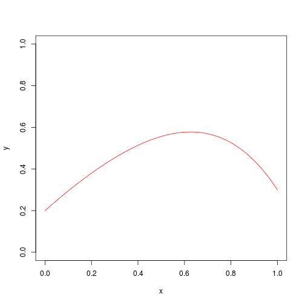
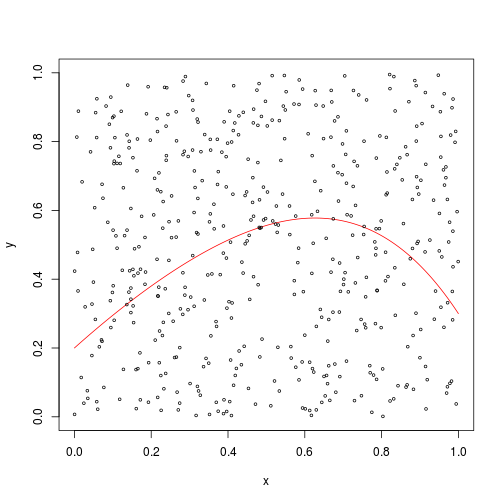
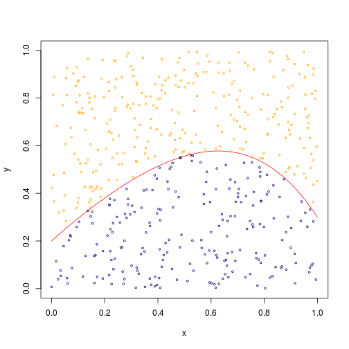
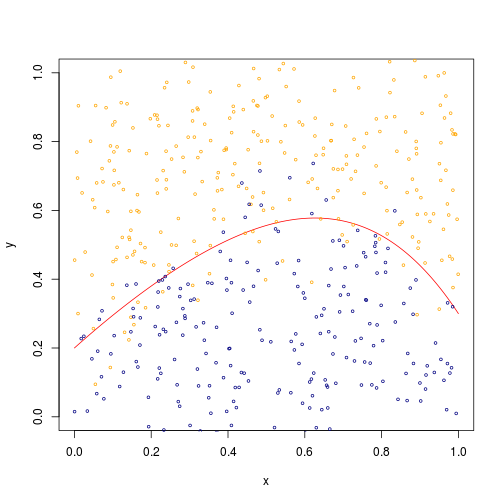
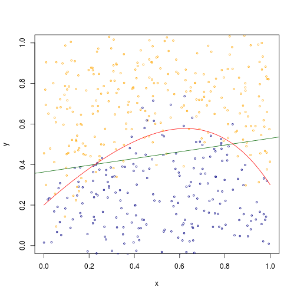
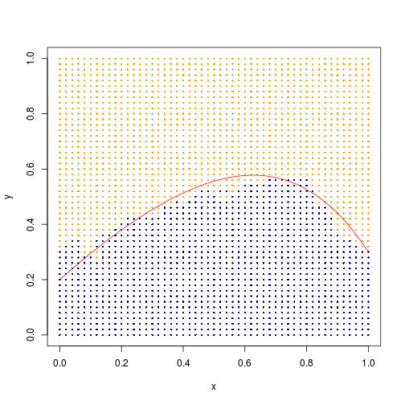

# Simple Learning Algorithms for Binary Classification


## Simulating data

Assume a true decision boundary in a unit square with functional form: $y = 0.2 + x + 0.5 x^2 + 0.1 x^3 - 0.5 x^4$

```r
f<-function(x){
  return(0.2 + x - 0.5*x^2 + 0.1*x^3 - 0.5*x^4)
}
xv = seq(0,1,0.001)
yv = f(xv)
plot(yv~xv,xlim=c(0,1), ylim=c(0,1),t = "l",col="red",xlab="x", ylab="y")
```



Simulate 500 data points uniformly distributed in the unit square

```r
dx = runif(500)
dy = runif(500)
plot(yv~xv,xlim=c(0,1), ylim=c(0,1),t = "l",col="red",xlab="x", ylab="y")
points(dy~dx,cex=0.5)
```




Classify the points above the boundary as "orange", and "blue" otherwise

```r
boundry = f(dx)
label = (dy>boundry)+0
plot(yv~xv,xlim=c(0,1), ylim=c(0,1),t = "l",col="red",xlab="x", ylab="y")
points(dy[label==1]~dx[label==1],cex=0.5,col="orange")
points(dy[label==0]~dx[label==0],cex=0.5,col="navyblue")
```



Finally, add some white noise to y and obtain the final observed training data.

```r
x_value = dx
y_value = dy + rnorm(length(dy),sd=0.1)
training_data = cbind(y_value, x_value, label)
plot(yv~xv,xlim=c(0,1), ylim=c(0,1),t = "l",col="red",xlab="x", ylab="y")
points(y_value[label==1]~x_value[label==1],cex=0.5,col="orange")
points(y_value[label==0]~x_value[label==0],cex=0.5,col="navyblue")
```



##  Linear classifier

Fit a probit model using the training data

```r
fit = glm(label~y_value+x_value,family=binomial(link="probit"))
fit
```

```
## 
## Call:  glm(formula = label ~ y_value + x_value, family = binomial(link = "probit"))
## 
## Coefficients:
## (Intercept)      y_value      x_value  
##      -2.459        6.768       -1.124  
## 
## Degrees of Freedom: 499 Total (i.e. Null);  497 Residual
## Null Deviance:	    686.9 
## Residual Deviance: 265.4 	AIC: 271.4
```

```r
intercept = -fit$coef[1]/fit$coef[2]
slope = -fit$coef[3]/fit$coef[2]

plot(y_value[label==1]~x_value[label==1],cex=0.5,col="orange",xlim=c(0,1),ylim=c(0,1), xlab="x", ylab ="y")
points(y_value[label==0]~x_value[label==0],cex=0.5,col="navyblue")
abline(intercept,slope,col = "darkgreen")
lines(yv~xv,col="red")
```



## k-nearest neighbor classifier

Generate a $101 \times 101$ grid on the unit square


```r
xg = seq(0,1,0.02)
yg = seq(0,1,0.02)
Grid = expand.grid(xg,yg)
dim(Grid)
```

```
## [1] 2601    2
```
A function to perform majority voting with k-nearest neighbors

```r
vote<-function(target, K, td = training_data  ){
   dist = apply(td,1, function(x) (x[1]-target[1])^2+(x[2]-target[2])^2)
   # find the first k-ranked points
   index = which(rank(dist)<=K)
   rst = 1
   if(sum(td[index,3])<K/2){
     rst = 0
   }
   return(rst)
}
```

set $K = 15$ and all grids


```r
est_rst = apply(Grid,1,function(x) vote(x,K=15))
```

Visualize the result


```r
plot(Grid[,1]~Grid[,2], pch=16,cex=0.45,xlab="x",ylab="y",col="navyblue")
index = which(est_rst==1)
points(Grid[index,1]~Grid[index,2], col="orange",pch=16,cex=0.45)
lines(yv~xv,col="red")
```



